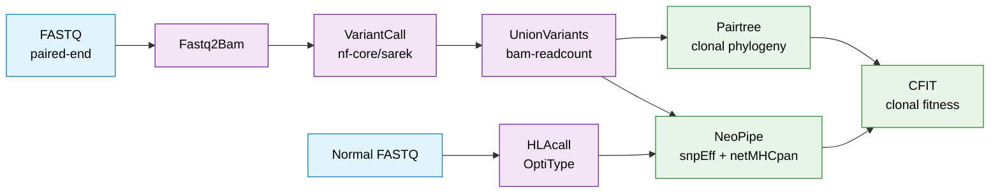

# LynchCohortPipelines

End-to-end cancer genomics pipelines for Lynch syndrome cohort analysis — from paired-end sequencing reads through somatic variant calling, clonal phylogeny reconstruction, HLA typing, and neoantigen prediction.

Developed at the [Luksza Lab](https://labs.icahn.mssm.edu/lukszalab/) (Icahn School of Medicine at Mount Sinai) to process a Lynch syndrome patient cohort. The pipelines are designed around a **modular, per-patient execution model**: each stage is a wrapper script that parallelizes across samples and submits jobs to an LSF HPC scheduler, with Singularity containers for reproducibility across HPC systems.

---

## Stack

- **Python 3.7+** &mdash; core scripts, data models, and pipeline wrappers
- **[Nextflow](https://www.nextflow.io/)** via [nf-core/sarek 3.4.2](https://nf-co.re/sarek/3.4.2/) &mdash; somatic variant calling
- **[Singularity](https://sylabs.io/singularity/) 3.6+** &mdash; containerized, reproducible deployment
- **LSF** &mdash; job scheduler for per-sample parallel execution
- **[Conda](https://docs.conda.io/)** &mdash; environment management (Pairtree)
- **Bash** &mdash; wrapper scripts orchestrating each stage

### Integrated bioinformatics tools: 
BWA-MEM, samtools, Picard, GATK, Strelka, Mutect2, bam-readcount, OptiType, snpEff, Varcode, netMHCpan 4.1, Pairtree, CFIT.

---

## Pipeline Architecture



Each stage is a standalone sub-pipeline with its own README and configuration, runnable independently or chained end-to-end for a patient.

---

## Pipeline Stages

| # | Stage | Purpose | Key Tools | Docs |
|---|-------|---------|-----------|------|
| 1 | **Fastq2Bam** | Align paired-end reads to hg19 / hg38; optional indel realignment and BQSR | BWA-MEM, samtools, Picard, GATK | [Fastq2Bam.md](Fastq2Bam.md) |
| 2 | **VariantCall** | Somatic SNV + indel calling, tumor vs. matched normal | nf-core/sarek (Strelka, Mutect2) | [VariantCall.md](VariantCall.md) |
| 3 | **UnionVariants** | Union of variants across samples with per-sample bam read counts | bam-readcount | [UnionVariants.md](UnionVariants.md) |
| 4 | **Pairtree** | Subclone clustering + phylogenetic reconstruction of clonal evolution | Pairtree | [Pairtree.md](Pairtree.md) |
| 5 | **HLAcall** | HLA class-I typing from normal-sample reads | OptiType | [HLAcall.md](HLAcall.md) |
| 6 | **NeoPipe** | VCF annotation + neoantigen calling + CFIT dataset prep | snpEff, Varcode, netMHCpan 4.1 | [NeoPipe.md](NeoPipe.md) |
| 7 | **CFIT** | Cancer clone fitness modeling | CFIT | [CFIT.md](CFIT.md) |

Additional utilities:
- **STAR** (RNA-seq alignment) &mdash; [STAR.md](STAR.md)
- **Varcode annotation** &mdash; `python varcode_annotate.py -patient <id> -hdir <dir>`
- **Figure generation** (shared frameshifts, specific-variant tracking) &mdash; [ForFigureGeneration.md](ForFigureGeneration.md)

---

## Quick Start

```bash
# 1. Configure paths and HPC variables
cp config.template.sh config.sh
vi config.sh   # fill in reference paths, HOME_DIR, tool paths, LSF project

# 2. Create the patient samplesheet
python create_patient_samplesheet.py \
    -patient_dir Raw/Patient1 \
    -patient_id Patient1 \
    -samples S1,S2,S3 \
    -normal_sample Normal \
    -fastq_dir /path/to/fastqs

# 3. Run the pipeline end-to-end (each step submits LSF jobs)
./submit_fastq2bam_for_patient.sh       -p Patient1 -s samplesheet.csv
./submit_variantcall_for_patient.sh     -p Patient1 -s samplesheet.csv
./union_variants.sh                     -p Patient1 -s samplesheet.csv --filter_variants
./pairtree.sh                           -p Patient1
./submit_hlatyping_for_patient.sh       -p Patient1 -s samplesheet.csv --normal_only
./neopipe.sh                            -p Patient1 -sample_info sample_info.txt
python import_to_cfit.py -hdir $HOME_DIR -patient_id Patient1
```

Each stage is documented in its own README (links in the table above).

---

## Design

A few choices worth flagging for anyone reading the code:

- **Per-patient orchestration.** Top-level wrapper scripts (`submit_*_for_patient.sh`) read the patient samplesheet, generate per-sample LSF jobs in parallel, and update the samplesheet in place as outputs land. Individual stages don't know about the cohort &mdash; they operate on a single sample and write to a predictable path, which keeps them testable and composable.
- **Centralized configuration.** All paths, reference genomes, HPC variables, and external tool locations live in `config.sh` (gitignored). This makes the codebase portable: deploying to a new HPC or switching reference builds (hg19 ⇄ hg38) is a config change, not a code change.
- **Containerized stages.** Tool-compatibility issues across HPC modules were a recurring pain point, so the Fastq2Bam stage runs inside a Singularity image (`library://verammaz/bioinformatics/fastq2bam:0.3`) pinning exact versions of BWA, samtools, Picard, and GATK.
- **Standardized I/O schemas.** A shared `Variant` Python class and common VCF column convention (`DP:AP` &mdash; total depth and ref-allele depth) let downstream stages consume any stage's output without format translation. Custom parsers normalize outputs from 10+ third-party tools into this schema.
- **Union-variant recounting.** Per-sample VCFs have disjoint variant sets by default. `union_variants.sh` computes the cohort-level union and uses `bam-readcount` to recompute counts at every locus in every sample &mdash; so Pairtree and CFIT see a consistent variant matrix across the patient.

---

## Repository Structure

Pipelines assume a standardized home directory layout for raw data, processed outputs, and analysis results:

```
$HOME_DIR/
├── Raw/                                  # Patient raw data
│   └── Patient/
│       ├── samplesheet.csv               # sample configuration
│       ├── Sample1/
│       │   ├── <Sample1>.bam
│       │   ├── <Sample1>_vs_Normal.strelka.somatic_{indels,snvs}.vcf.gz
│       │   └── <Sample1>_vs_Normal.mutect2.filtered.vcf.gz
│       ├── Normal/
│       └── ...
├── VCF/                                  # Processed per-sample VCFs
│   └── Patient/
│       ├── <Sample>.vcf                  # standardized across samples
│       ├── <Sample>_ann.vcf              # snpEff-annotated
│       └── <Sample>_varcode.vcf          # Varcode-annotated
├── PairTrees/                            # Pairtree outputs
│   └── Patient/
│       ├── <Patient>.ssm
│       ├── <Patient>.params.json
│       ├── <Patient>_results.npz
│       └── <Patient>_plottree.html
├── Neoantigens/                          # NeoPipe outputs
│   ├── neoantigens_<Patient>.txt
│   └── neoantigens_other_<Patient>.txt
├── HLA/
│   └── HLA_calls.txt                     # tab-separated HLA calls per patient
├── Plots/
│   ├── TreePlots/
│   └── VariantPlots/
├── sample_info.txt                       # per-sample timepoint + tissue metadata
├── patient_sex.txt                       # (optional) per-patient sex
├── cfit_config.json                      # CFIT run config
└── cfit_mapping.json                     # CFIT patient ↔ sample mapping
```

See individual stage READMEs for file-level details.

---

## Configuration

All paths and HPC variables are centralized in `config.sh` (copy from `config_template.sh` on first use). Each reference genome has its own set of variables:

```bash
REF_FASTA_hg19, INDELS_1_hg19, PON_hg19, SITES_OF_VARIATION_hg19, EXOME_INTERVALS_hg19, ...
REF_FASTA_hg38, INDELS_1_hg38, PON_hg38, SITES_OF_VARIATION_hg38, EXOME_INTERVALS_hg38, ...
```

Wrapper scripts select the correct reference based on the `--ref` flag (default `hg19`).

---

## Requirements

- Linux HPC environment with LSF job scheduler
- Singularity ≥ 3.6
- Python ≥ 3.7
- Conda (for the Pairtree environment)
- `nextflow` executable installed locally (path set in `config.sh`)
- External tools referenced in `config.sh`: netMHCpan 4.1, snpEff 4.3t, Pairtree, NeoPipe, CFIT

Tool-specific installation instructions live in each stage's README.

---

## Context & Credits

The pipelines wrap methods developed by others into a unified, reproducible, HPC-friendly framework:

- **nf-core/sarek** &mdash; community variant-calling pipeline ([nf-core/sarek](https://nf-co.re/sarek/))
- **Pairtree** &mdash; subclone clustering + phylogenetic reconstruction ([Morris Lab](https://github.com/morrislab/pairtree))
- **NeoPipe** &mdash; neoantigen calling pipeline ([Luksza Lab, private repo](https://github.com/LukszaLab/NeoPipe/))
- **CFIT** &mdash; cancer clone fitness modeling ([Luksza Lab, private repo](https://github.com/LukszaLab/CFIT/))

Developed at the Luksza Lab to support cancer evolution and neoantigen-driven fitness modeling studies on a Lynch syndrome patient cohort.
